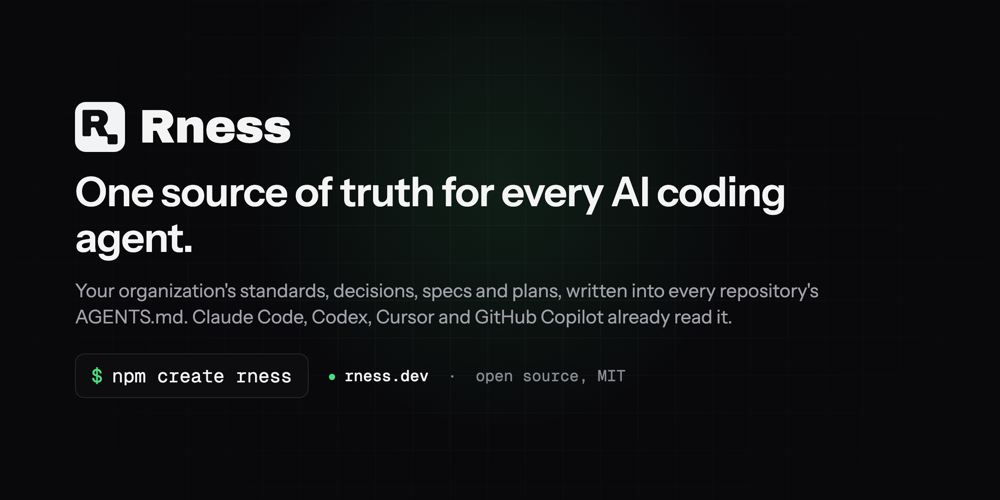

<p align="center">
  <a href="https://rness.dev"></a>
</p>

<p align="center">
  <a href="https://www.npmjs.com/package/@rness/cli"></a>
  <a href="https://github.com/rness-dev/rness/actions/workflows/ci.yml"></a>
  <a href="LICENSE"></a>
  
</p>

# Rness

Your organization's standards, decisions, specs and plans, written into
every repository's `AGENTS.md`. Claude Code, Codex, Cursor and GitHub
Copilot already read that file: nothing else changes in how you work.

A team that codes with agents across several repositories ends up with a
`CLAUDE.md` copied by hand into each one, changed in one and not the
others. Rness keeps the rules in one repository, `.rness`, and writes what
applies into each repository. It never runs a model and is not an agent.

```bash
npm create rness
```

[Website](https://rness.dev) · [Documentation](https://rness.dev/docs) ·
[CLI reference and changelog](packages/cli/README.md) ·
[Discussions](https://github.com/rness-dev/rness/discussions)

## What you get

- **One context repository.** `.rness/` holds the organization's
  standards, ADRs, specifications and plans as Markdown, with a
  `rness.json` that maps them to the repositories they apply to.
- **A generated block in every repository.** `rness sync` writes the rules
  that apply into each clone's `AGENTS.md` (and a `CLAUDE.md` that points
  to it). `rness sync --check` fails CI when a block is out of date.
- **Claude Code wired in.** Hooks load the workspace context at session
  start and validate every edit under `.rness/`; the `/rness:status`,
  `/rness:adr`, `/rness:spec` and `/rness:plan` commands run the document
  lifecycle from the conversation; `rness mcp` serves the
  same context to any MCP client.
- **Where everything stands.** `rness status` shows every decision,
  specification and plan and its status, in a terminal or as Markdown.
  `rness pulse` puts them on a GitHub Project, Agent Pulse: one issue per
  document, the card an agent is working on marked while it works.
- **Upgrades without surprises.** The CLI version is pinned in
  `.rness/package.json`; every `rness` in the workspace delegates to it.
  `rness upgrade` moves the pin and merges the scaffold's changes with git.

## Quick start

```bash
npm create rness           # asks for your GitHub organization, or a blank workspace
cd <your-org>
rness add <repo>           # clone a repository of the organization into org/<repo>
rness sync                 # write the generated block into each clone
rness status               # every decision, spec and plan, and its status
```

`npm create rness` joins the organization's `.rness` when it exists, or
starts one. A workspace is a directory per person:

```
<your-org>/
├── .rness/        standards, adr/, specs/, plans/, rness.json  (the context repository)
└── org/<repo>/    one clone per repository, each with its generated AGENTS.md block
```

No GitHub organization yet? `npm create rness <name> --blank` makes a
workspace without one; bring repositories in with `rness add <owner>/<repo>`
or a git URL.

The full reference, every flag and the changelog of each release:
[`packages/cli/README.md`](packages/cli/README.md). The guide for users:
[rness.dev/docs](https://rness.dev/docs).

## Agents

Rness writes files, not prompts. Any agent that reads `AGENTS.md` gets the
organization's rules: Claude Code, Codex, Cursor and GitHub Copilot are the
ones verified to. Claude Code gets more, through its `.claude/` files: the
hooks, the skills and the MCP server above.

## Packages

| Path                    | npm                                                                                 |
| ----------------------- | ----------------------------------------------------------------------------------- |
| `packages/cli`          | [`@rness/cli`](https://www.npmjs.com/package/@rness/cli), the `rness` command       |
| `packages/create-rness` | [`create-rness`](https://www.npmjs.com/package/create-rness), `npm create rness`    |
| `packages/create`       | [`@rness/create`](https://www.npmjs.com/package/@rness/create), `npm create @rness` |

All three share one version. Rness is at 0.x: commands and the `rness.json`
contract can still change between minor versions; the changelog says what
did.

## Develop

Node 24 or later to develop (the published CLI runs on Node 22.17 or later, ADR 0010), pnpm through Corepack, TypeScript.

```bash
pnpm install
pnpm lint && pnpm format:check                # eslint, prettier (CI runs both)
pnpm typecheck && pnpm test && pnpm build     # every package
pnpm check:versions [--tag v0.18.0]           # lockstep versions; with the tag before a release
pnpm lint:fix && pnpm format                  # apply the fixes
RNESS_NO_DELEGATE=1 node packages/cli/src/bin/rness.ts --help     # run the CLI from source
```

Try a release before publishing it, through a local npm registry
([verdaccio](https://verdaccio.org), state in `.verdaccio/`):

```bash
pnpm verdaccio start     # registry on http://127.0.0.1:4873 (VERDACCIO_PORT to change)
pnpm verdaccio deploy    # build, then publish every package to it (never to npmjs)
export npm_config_userconfig="$PWD/.verdaccio/npmrc"
cd "$(mktemp -d /tmp/rness-XXXX)" && npm create rness <org>   # the published shim, as a user runs it
unset npm_config_userconfig
pnpm verdaccio stop      # or `clean` to also delete what it stored
```

`deploy` replaces a version already deployed, so it can run again after a
change; it also clears the npx cache (`<npm cache>/_npx`), which would
otherwise keep serving the first copy of that version to `npm create`.

Maintainers release by tagging `vX.Y.Z`; GitHub Actions publishes the
packages to npm, then starts the `Release` workflow of
[rness-dev/docs](https://github.com/rness-dev/docs), which opens the pull
request that freezes the docs for that version. That last step needs the
repository secret `DOCS_RELEASE_TOKEN` (Settings, Secrets and variables,
Actions): a fine-grained personal access token with Actions read and write
on `rness-dev/docs` only. Without it the docs wait for their hourly run.

## Community

- **Questions and ideas**: [Discussions](https://github.com/rness-dev/rness/discussions).
- **Bugs and features**: [Issues](https://github.com/rness-dev/rness/issues/new/choose).
- **Contributing**: [CONTRIBUTING.md](https://github.com/rness-dev/.github/blob/main/CONTRIBUTING.md),
  under the [code of conduct](https://github.com/rness-dev/.github/blob/main/CODE_OF_CONDUCT.md).
- **Security**: never in public, see [SECURITY.md](https://github.com/rness-dev/.github/blob/main/SECURITY.md).

Rness is built with Rness: this repository is a member of the `rness-dev`
workspace, its `AGENTS.md` is generated, and its specifications and plans
run on Agent Pulse.

## Licence

[MIT](LICENSE).
